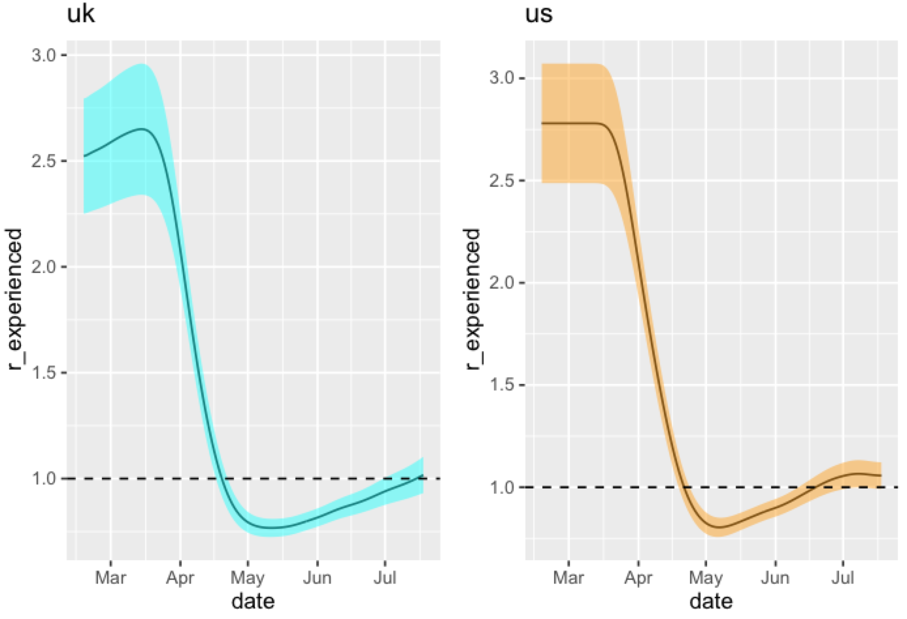

# Introduction

This is my attempt to recreate the model from Imperial College London's COVID-19 Report 26. It can be found
[here](https://www.imperial.ac.uk/media/imperial-college/medicine/mrc-gida/2020-06-08-COVID19-Report-26.pdf).

The model treats the reproductive number as a smooth function of mobility:

` R_t = R_0 exp(-b*M) `

... where `M` represents mobility data (from Google) that's in `[-1, 0]`. In the stan model I've written,
I've made a small chamge to this to make post-lockdown behaviour not be exactly the same as pre-lockdown behaviour.

` R_t = R_0 exp(-b_0*M - s(t)*b_1) `

... where `b_1` is in `[0, 100]` and represents my belief that mobility post-lockdown will correspond to a smaller
reproductive rate than pre-lockdown mobility of the same level. This model resulted in sensible predictions in some
tests that I ran. `s(t)` is a smooth step function that steps up during
April 2020.

The observation model is roughly:

`D_t ~ NegBin2(R_t^eff * D_t^eff, d)`

... where `R_t^eff` is the effective reproductive rate after accounting for the infection-to-death distribution and
`D_t^eff` is the effective number of previous deaths that lead to more deaths in the current time period (this figure
accounts for the serial interval distribution - the waiting time between infector and infectee deaths). Refer to the 
model doc for details as my understanding can very well be wrong.

---

# Example Outputs

Please take results with a grain of salt as they might not be accurate. If you see an issue, please feel free to raise
an issue or a PR.

